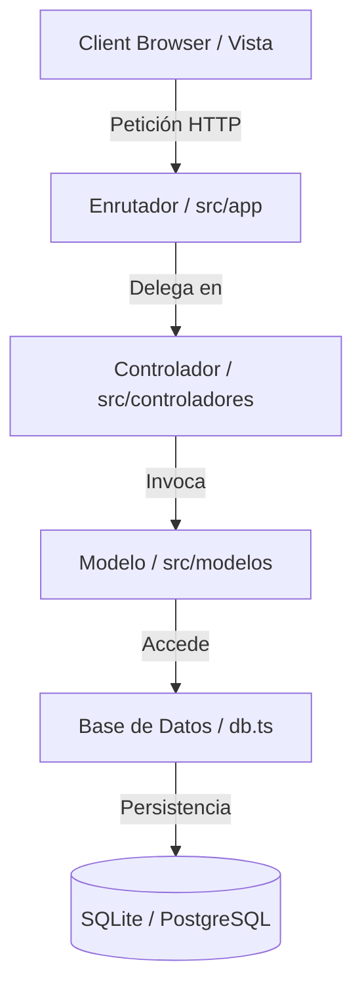

# Arquitectura del Sistema: MVC

La aplicación **Neuro Vision** adopta el patrón de diseño **Model-View-Controller (MVC)** para separar limpiamente las responsabilidades de la lógica de interfaz de usuario de la persistencia de datos.

---

## 🧩 Componentes

### 1. [[Modelos_Datos|Model (Modelo)]]
*   Representa la capa de datos. Define las entidades y realiza las consultas a la base de datos a través de la abstracción de [[Modelos_Datos|Patient]] y [[Modelos_Datos|Session]].
*   Ubicación: `src/modelos/`

### 2. [[Vistas_Usuario|View (Vista)]]
*   Representa la presentación de la interfaz de usuario. Son componentes React puros en [[Vistas_Usuario|DashboardView]], [[Vistas_Usuario|CaptureView]] y [[Vistas_Usuario|TrendsView]] que no interactúan de forma directa con la base de datos, sino a través del envío de formularios y peticiones HTTP.
*   Ubicación: `src/vistas/`

### 3. [[Controladores_Negocio|Controller (Controlador)]]
*   Representa la mediación y lógica de negocio. Valida los datos entrantes de la Vista, orquesta las acciones y ejecuta fallbacks elegantes antes de interactuar con el Modelo.
*   Ubicación: `src/controladores/`

---

## 🔗 Nodos Relacionados
*   [[Inicio]]: Volver al panel principal.
*   [[Modelos_Datos]]: Detalle de los modelos del sistema.
*   [[Controladores_Negocio]]: Lógica de controladores.
*   [[Vistas_Usuario]]: Detalle de las vistas del sistema.
