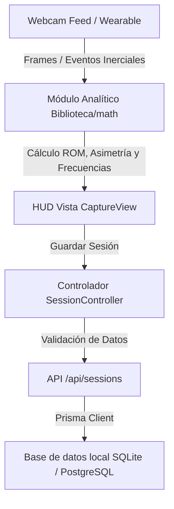

# Especificación Técnica: Arquitectura General del Sistema

Este documento define la arquitectura global de **Neuro Vision**, sirviendo como guía de referencia técnica para asegurar la coherencia arquitectónica y la integración armoniosa de las distintas fases del backlog.

---

## 💻 1. Stack Tecnológico

*   **Framework Frontend/Backend:** Next.js v16.2.9 (Enrutador de App con soporte para Server Actions e API Routes).
*   **Lenguaje:** TypeScript v5 (Tipado estricto habilitado).
*   **Base de Datos / ORM:** Prisma Client v5.15.0 con soporte polimórfico:
    *   *Desarrollo/Consultorio:* SQLite local (`base_de_datos/parkinson.db`).
    *   *Producción/Vercel:* Neon PostgreSQL o Supabase DB.
*   **Procesamiento de Visión:** Biblioteca MediaPipe Tasks Vision (`@mediapipe/tasks-vision` v0.10.35) ejecutándose en la CPU/GPU del cliente mediante WebGL.
*   **Visualización:** Recharts v3.9.0 para paneles dinámicos interactivos.
*   **Exportación de Datos:**
    *   `xlsx` para exportación de hojas de cálculo detalladas frame a frame.
    *   `jspdf` para generación y formateo de informes interpretativos clínicos.

---

## 🏛️ 2. Estructura de Directorios y Capas (MVC)

El repositorio está estructurado bajo las directrices de la Constitución del Proyecto para asegurar una clara separación de responsabilidades:

```
PROYECTO NEURO VISION/
├── base_de_datos/         # Persistencia local y migraciones SQL
├── prisma/                # Esquemas y generación del cliente Prisma ORM
├── specs/                 # Especificaciones técnicas de desarrollo (SDD)
└── src/                   # Código de la aplicación web
    ├── app/               # Enrutamiento de Next.js (Rutas visuales y APIs HTTP)
    │   ├── api/           # Endpoints HTTP (pacientes, sesiones, informes)
    │   ├── capture/       # Vista de grabación y análisis en vivo
    │   ├── trends/        # Vista de evolución histórica comparativa
    │   └── page.tsx       # Landing page / Panel principal
    ├── vistas/            # [VIEW] Presentación y componentes de página React
    ├── controladores/     # [CONTROLLER] Lógica de validación, consultas y APIs
    ├── modelos/           # [MODEL] Esquemas de datos e interfaces tipadas
    ├── componentes_visuales/ # Fragmentos UI reutilizables (HUD, gráficos, barra de navegación)
    ├── contexto_global/   # Proveedores de estado global (Paciente activo, configuraciones)
    └── biblioteca/        # Funciones auxiliares y módulos analíticos matemáticos (math/)
```

---

## 🔄 3. Flujo y Ciclo de Vida de los Datos Clínicos

El flujo de procesamiento de datos sigue un ciclo unidireccional y robusto:



### 3.1. Entidades de Base de Datos Principales
*   **Patient (Paciente):** Representa al sujeto clínico evaluado.
    *   `id`: UUID
    *   `name`: Nombre completo
    *   `birthDate`: Fecha de nacimiento (para indexar rango etario e interpretar amplitudes)
    *   `createdAt`: Fecha de registro
*   **Session (Sesión de Medición):** Almacena las variables cuantitativas de una prueba.
    *   `id`: UUID
    *   `patientId`: Relación de clave foránea
    *   `modo`: Estado farmacológico (`PRE` vs `POST` L-Dopa o hitos terapéuticos)
    *   `region`: Zona analizada (`CEJA`, `PARPADO`, `BOCA`, `NARIZ`, `BRAZO`, `PIERNA`, etc.)
    *   `lado`: Lateralidad evaluada (`IZQUIERDA`, `DERECHA`, `BILATERAL`)
    *   `tiempoMedicion`: Duración total del registro en segundos
    *   `anguloMin`, `anguloMax`, `anguloPromedio`: Amplitudes angulares (ROM)
    *   `velocidadMax`: Velocidad angular pico registrada
    *   `frecuenciaTemblor`, `amplitudTemblor`: Frecuencia dominante (Hz) y amplitud pico calculada por FFT
    *   `asimetriaIndex`: Diferencia de ROM entre lado izquierdo y derecho en %
    *   `datosAngulos`: Serie de tiempo cruda serializada cuadro por cuadro para exportación e investigación

---

## 🛡️ 4. Reglas de Validación y Resiliencia

1.  **Offline Resiliente:** En caso de caída de base de datos PostgreSQL, el adaptador de base de datos en `src/biblioteca/db.ts` debe reaccionar de forma automática degradando la persistencia a SQLite local sin interrumpir la experiencia de usuario clínica en la interfaz.
2.  **Validación de Tracking:** Si MediaPipe reporta una calidad de landmarks menor a un umbral configurado de visibilidad de 0.65 (`UMBRAL_VISIBILIDAD`), el sistema descartará los fotogramas del cálculo final para prevenir distorsiones en los resultados analíticos.
